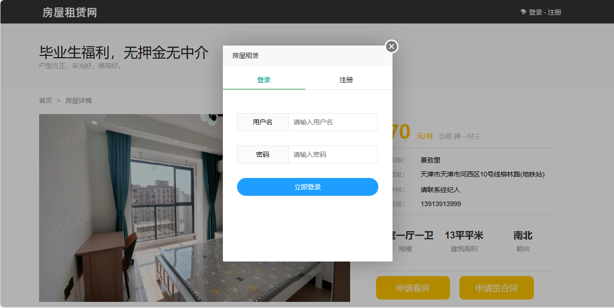
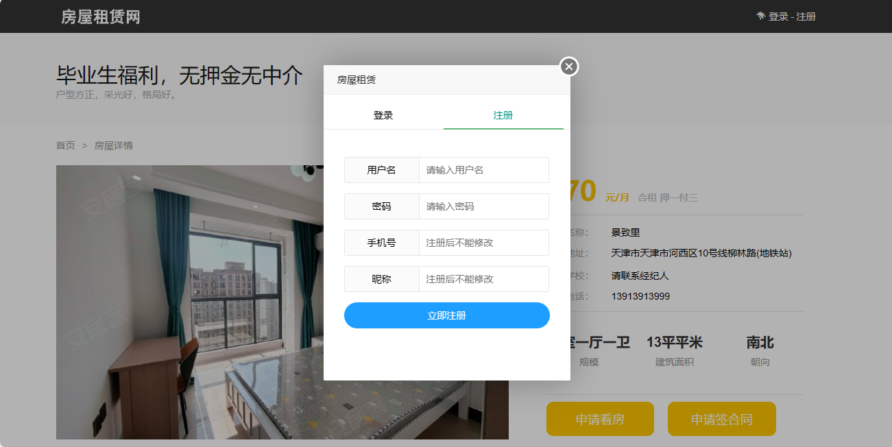
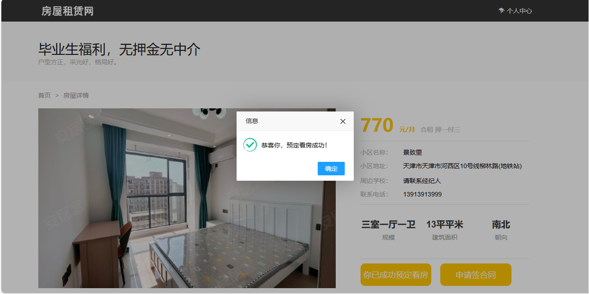
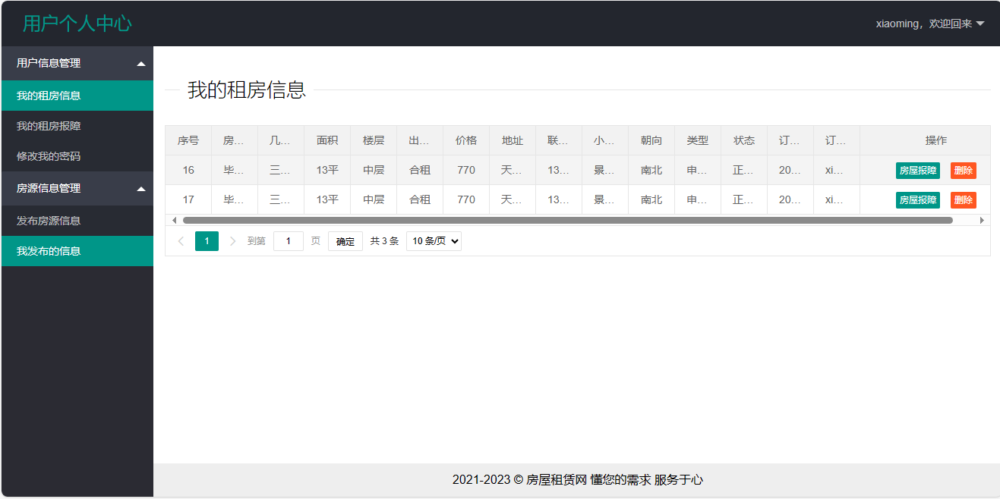
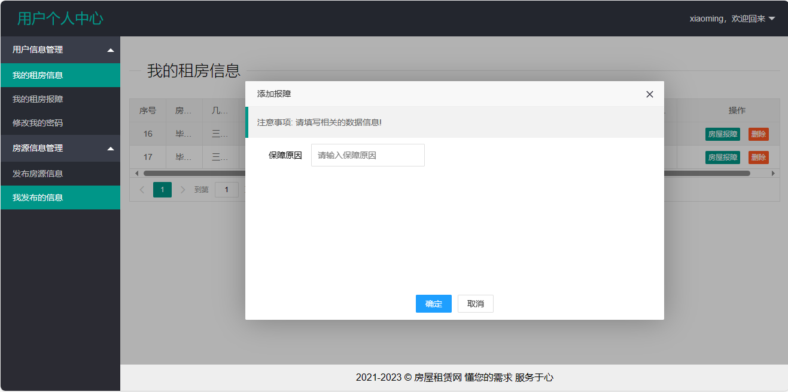
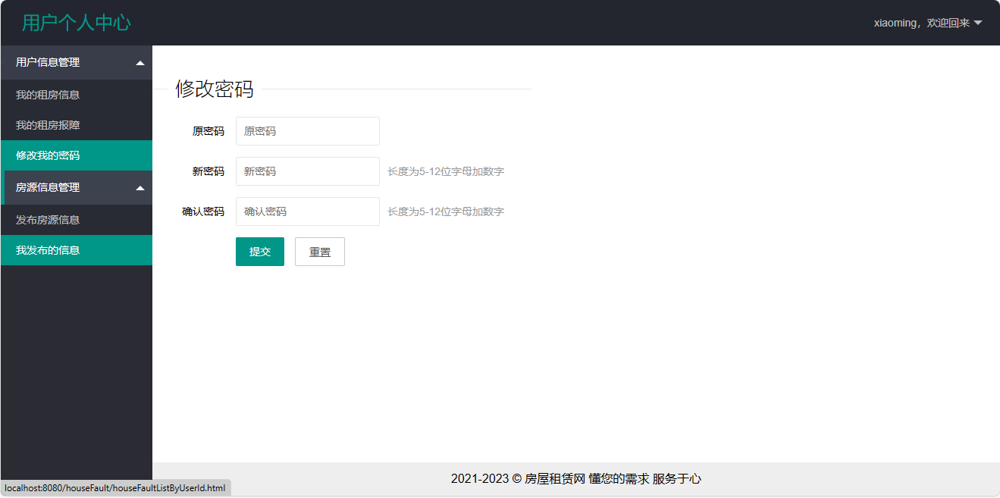
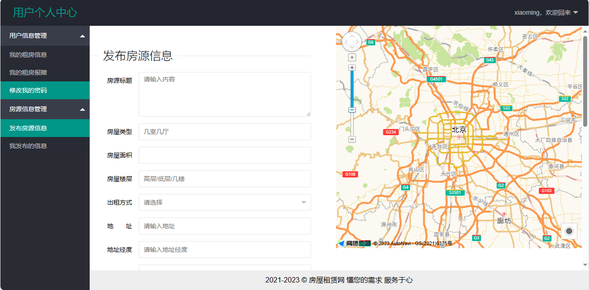
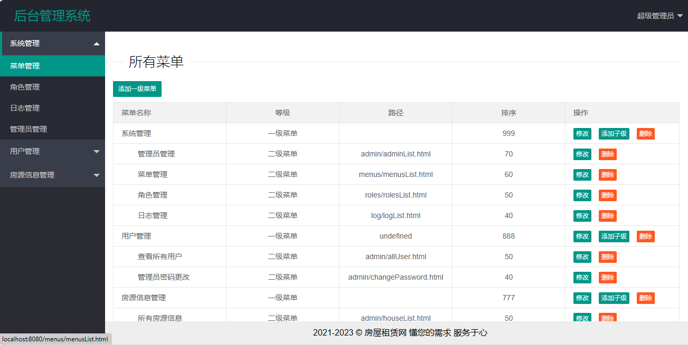
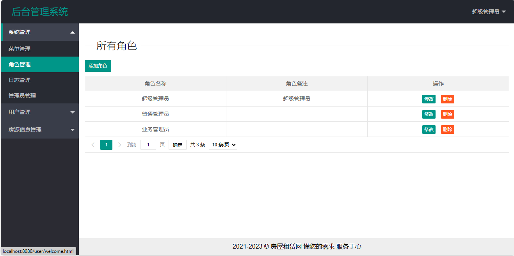
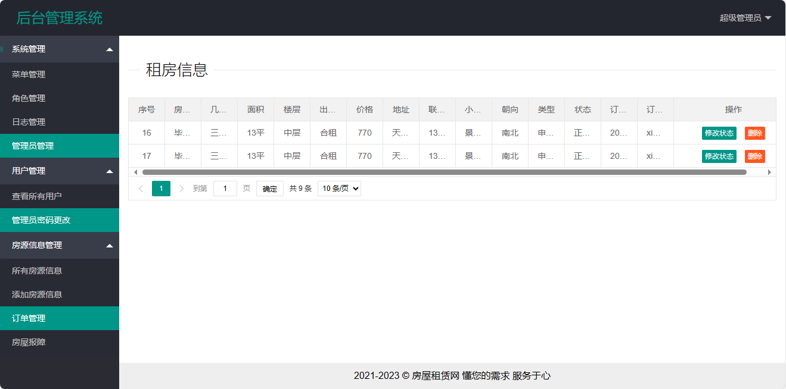

<h1 align="center">基于SSM+Jsp的房屋租赁系统</h1>

 获取sql文件 QQ: 386869957 QQ群: 377586148 

 [个人站点: 从戎源码网](https://armycodes.com/)

## 简介

> 本代码来源于网络,仅供学习参考使用!
>
> 提供1.远程部署/2.修改代码/3.设计文档指导/4.框架代码讲解等服务
>
> 前端访问地址： http://localhost:8080/index.html
>
> 用户名： user
> 密码： 123456
>
> 后端访问地址： http://localhost:8080/admin/index.html
>
> 用户名： admin
> 密码： 123456
>
> 部署要求：
> 1.建立HouseRentalSystem\src\resources\upload\hrs目录，图片使用，复制绝对路径，然后修改MyUtil代码中的路径配置
> 2.高德开放KEY值

## 项目介绍

基于SSM+Jsp的房屋租赁系统，前端 `Layui`，后端 `Spring` `SpringMVC` `MyBatis`，系统分为用户以及管理员，主要功能如下：

### 用户：

- 基本操作：登录、注册、修改密码、退出
- 房源查看：房源列表、价格排序、房屋详情
- 房源信息管理：房源信息列表、发布房源、我的发布、房源修改、房源删除、预定看房、申请签订合同
- 用户信息管理：我的租房信息、租房信息修改、租房信息删除、我的租房故障

### 管理员：

- 基本操作：登录、修改密码、退出
- 菜单管理：树形列表、添加一级菜单、添加子级、菜单修改、菜单删除
- 角色管理：角色列表、添加角色、角色修改、角色删除
- 日志管理：日志列表
- 管理员管理：列表查询、添加管理员、修改管理员、初始化密码、删除管理员
- 用户管理：用户列表、用户修改、用户删除
- 房源信息管理：房源信息列表、房源信息修改、房源信息删除、添加房源信息、订单列表、订单状态修改、订单删除、房屋故障列表、房屋故障状态修改

## 环境

- `<b>`IntelliJ IDEA 2021.2 `</b>`
- `<b>`Mysql 5.7.26 `</b>`
- `<b>`Navicat  11.1.20.0 `</b>`
- `<b>`Tomcat 7.0.73 `</b>`
- `<b>`JDK 1.8 `</b>`

## 缩略图

